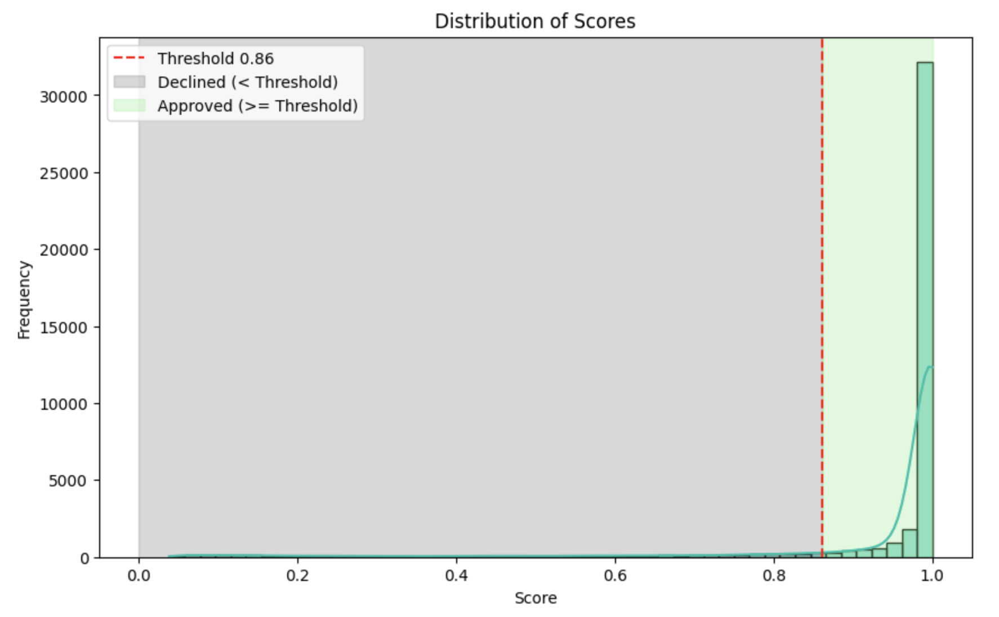

# Riskified Case

## Objective
To carry out an exploratory and financial analysis based on a dataset containing classification scores, order values and approval or chargeback status.  
The aim is to simulate automatic order approval decision scenarios based on score, understand the distribution of scores and calculate the fee required to maintain the desired ratio between revenue and cost of chargebacks.

## Task 1: Set threshold for 90% pass rate

- **Method**  
  The 10th percentile (`quantile(0.10)`) of the `classification_score` has been calculated.
  In this way, requests with a score **above the threshold will be approved**, ensuring that approximately 90% of requests are approved automatically.

- **Result**  
  - Calculated threshold: **0.86**
  - Proportion of requests approved with this threshold: **90%**
  - Proportion of requests rejected with this threshold: **10%**
  - 10% of orders have a score of up to 0.86, and 90% have a score above 0.86.

## Task 2: Analysis of the distribution of scores

- **Method**  
  Used histogram with KDE to visualize the distribution of `classification_score`.
  The threshold defined in Task 1 was visually highlighted, separating the approval and rejection areas.

- **Insights**  
  The majority of requests have a high score, which justifies the possibility of maintaining a high approval rate safely.

- **Graph:**

## Task 3: Calculating the fee needed to balance costs and revenue

- **Method**  
  The total cost of expected chargebacks on approved orders was calculated.
  Potential revenue was calculated considering all approved orders with a hypothetical fee.
  The necessary fee was adjusted so that **the cost of chargebacks represents exactly 50% of the revenue generated**.

- **Formula applied:**

  $$
  \text{Fee} = \frac{\text{Cost of CHB}}{0.5 \times \text{Gross Revenue from Approvals}}
  $$

- **Results:**
  - Total estimated cost of chargebacks on approved orders: **$ 15,092.94**
  - Potential gross revenue (without fee): **$ 15,411,656.27**
  - **Fee required: 0.2%**

## Conclusion

The analysis showed that it is possible to maintain an automatic approval policy with 90% of requests, using the score as the sole criterion, with financial control over the cost of chargebacks via a fee adjustment.

## 🛠️ Technologies used

  

## 👩🏻‍💻 Author

## 🔓 License

